# ⚡ Basis-Zero: Yield-Funded Prediction Market
> **Trade the World, Keep Your Yield.**  
> *Built for the Yellow Network Hackathon Prize Track*

**Basis-Zero** is a capital-efficient prediction market that eliminates the opportunity cost of betting. By integrating **Real-World Asset (RWA)** yields directly into the collateral vault, users can trade prediction markets utilizing *only* the yield generated by their idle capital ("Safe Mode") or leverage their full principal ("Full Mode").

We bridge **DeFi Yield** (via RWA simulation) and **High-Frequency Trading** (via simulated Yellow Network state channels) to create a "No-Loss" gambling experience.

---

## 🏗️ Architecture Diagrams

### 1. System Components (Box Diagram)
High-level overview of how the Frontend, Backend (Yellow Node), and Blockchain interact.


### 2. The "Session" Flow (Sequence Diagram)
Demonstrating the lifecycle of a user's funds from On-Chain Deposit to Off-Chain Trade to Final Settlement.


---

## 🚀 Core Features

### 1. The Yield Vault 🏦
- **Principal Protection**: Funds deposited immediately start earning yield (simulating RWA tokens).
- **Safe Mode**: Toggle this to bet *only* with accrued yield. Your principal is never touched.
- **Real-Time Visualization**: Watch your yield grow second-by-second while you trade.

### 2. Yellow Network Integration 🟡
- **State Channels**: We use the **Yellow SDK (`@erc7824/nitrolite`)** to sign state transitions off-chain.
- **Gasless Trading**: Once a session is open, every trade is a simple cryptographic signature. No gas, instant confirmation.
- **Trustless Settlement**: The backend acts as a specific "Nitrolite Node," providing a final cryptographic proof that the smart contract verifies before releasing funds.

### 3. Automated Market Maker (AMM) 📊
- **CPMM Logic**: Constant Product (`x * y = k`) implementation for automated liquidity.
- **Binary Outcome**: YES/NO shares are minted and burned instantly.

---

## 🛠️ Tech Stack

| Component | Technology |
|-----------|------------|
| **Frontend** | Next.js 14, TailwindCSS, Shadcn/UI, Framer Motion |
| **Yellow SDK** | `@erc7824/nitrolite`, `viem` (Session Keys) |
| **Backend** | Node.js, Express, Supabase (State Store) |
| **Smart Contract** | Solidity 0.8.24, Foundry/Hardhat |
| **Chain** | Polygon Amoy Testnet |

---

## 🏁 Getting Started

### Prerequisites
- Node.js v18+ (Recommended v20 or v22)
- Git

### 1. Smart Contracts
Deploy the `SessionEscrow` logic to Polygon Amoy.

```bash
cd contracts
npm install
# Deploy using Hardhat
npx hardhat run scripts/deploy-session.ts --network amoy
```

### 2. Backend (The Hub)
Runs the off-chain AMM and Nitrolite Signer.

```bash
cd backend
npm install
cp .env.example .env
# Add your Private Key (SIGNER_PRIVATE_KEY) to .env

# ⚠️ PRO TIP: Use this command for stable execution
npx tsx src/index.ts
```

### 3. Frontend ( The Interface)
Launches the Next.js application.

```bash
cd frontend
npm install
cp .env.example .env
# Add NEXT_PUBLIC_WALLET_CONNECT_PROJECT_ID

npm run dev
```

Open `http://localhost:3000` and start trading!

---

---

## 🔮 Future Goals: Multi-Chain Unified Balance

> The contracts and backend modules for this architecture are **already built** (`NitroliteCustody.sol`, `clearnode/` backend module). The current demo runs single-chain on Polygon Amoy via `SessionEscrow`. The following describes the production-ready multi-chain expansion.

### Goal
Let users deposit USDC on **any supported chain** (Ethereum Sepolia, Polygon Amoy, Base Sepolia) and trade with a single **Unified Balance** — no bridging required.

### Architecture Overview

| Component | Current (v1) | Future (v2) |
|-----------|-------------|-------------|
| **Deposit Chain** | Polygon Amoy only | Any supported chain |
| **Custody Contract** | SessionEscrow.sol | NitroliteCustody deployed per chain |
| **Balance Source** | Single on-chain read | Aggregated across all chains via Clearnode |
| **Trading Channel** | HTTP API sessions | Nitrolite 2-party state channels |
| **Settlement** | settleSession() on Amoy | settleChannel() on deposit chain OR applyCrossChainSettlement() |
| **Yield** | On-chain in SessionEscrow | Separate yield layer (optional, only on Amoy) |

### Multi-Chain System Components


### Multi-Chain Session Flow (Sequence Diagram)

Demonstrates how a user deposits on Sepolia, trades using their Unified Balance, and settles — either back on Sepolia or cross-chain to Polygon Amoy.

```mermaid
sequenceDiagram
    actor User
    participant FE as Frontend
    participant CustodyX as NitroliteCustody<br/>(Any Chain)
    participant Clearnode as Yellow Clearnode
    participant UB as Unified Balance
    participant Backend as Broker / Backend
    participant AMM as AMM Engine

    Note over User, AMM: Phase 1 — Multi-Chain Deposit
    User->>FE: Choose chain & deposit amount
    FE->>CustodyX: deposit(amount) on chosen chain
    CustodyX-->>UB: Deposit event indexed
    UB->>Clearnode: Update unified balance

    Note over User, AMM: Phase 2 — State Channel & Trading
    FE->>Clearnode: Open state channel (ERC-7824)
    Clearnode->>Backend: Route channel to broker
    Backend->>AMM: Register session balance
    loop Trading Loop
        User->>FE: Place bet (sign intent)
        FE->>Backend: Submit signed intent
        Backend->>AMM: Execute trade
        AMM-->>Backend: Trade result
        Backend-->>FE: Updated position
    end

    Note over User, AMM: Phase 3 — Settlement
    User->>FE: Close session
    FE->>Backend: Request settlement
    Backend->>AMM: Calculate final P&L
    AMM-->>Backend: Settlement amounts

    alt Same-Chain Settlement
        Backend->>CustodyX: settleChannel(finalBalances)
        CustodyX-->>User: Release USDC on same chain
    else Cross-Chain Settlement
        Backend->>Clearnode: Request cross-chain settlement
        Clearnode->>CustodyX: applyCrossChainSettlement(proof)
        CustodyX-->>User: Adjusted balance on deposit chain
    end
```



### Key Differences from Current Implementation

| Aspect | Current (SessionEscrow) | Future (NitroliteCustody) |
|--------|------------------------|--------------------------|
| **Collateral locking** | `openSession()` locks on Polygon Amoy | `createChannel()` locks on any chain |
| **Trading** | Backend API calls, no state channel | Nitrolite 2-party state channel protocol |
| **Settlement signing** | Backend signs `keccak256(sessionId, pnl)` | Backend signs `keccak256(channelId, payoutA, payoutB, chainId)` |
| **Dispute resolution** | 24h timeout release | Challenge period — either party can submit a newer state |
| **Cross-chain** | Not supported | `applyCrossChainSettlement()` credits/debits on a different chain |
| **Yield** | Built into SessionEscrow | Off-chain yield calculation (or use SessionEscrow on Amoy for yield) |

### Contracts Already Built

- **`NitroliteCustody.sol`** — Nitrolite-compatible custody with channel management, cross-chain settlement, Clearnode signature verification
- **`SessionEscrow.sol`** — Already has `applyCrossChainSettlement()` to receive cross-chain proofs
- **Backend `clearnode/` module** — `ClearnodeClient`, `UnifiedBalanceService`, `MultiChainSettlement` — all ready for Clearnode WebSocket integration

---

## 🏆 Hackathon Tracks
**Yellow Network**:
- **SDK Integration**: Utilizes `SessionKeyStateSigner` for client-side signing.
- **Architecture**: Implements the "Hub-and-Spoke" state channel model.
